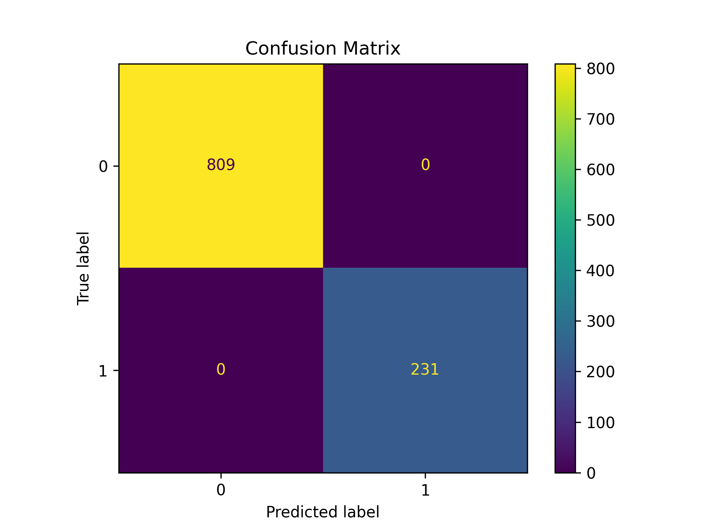
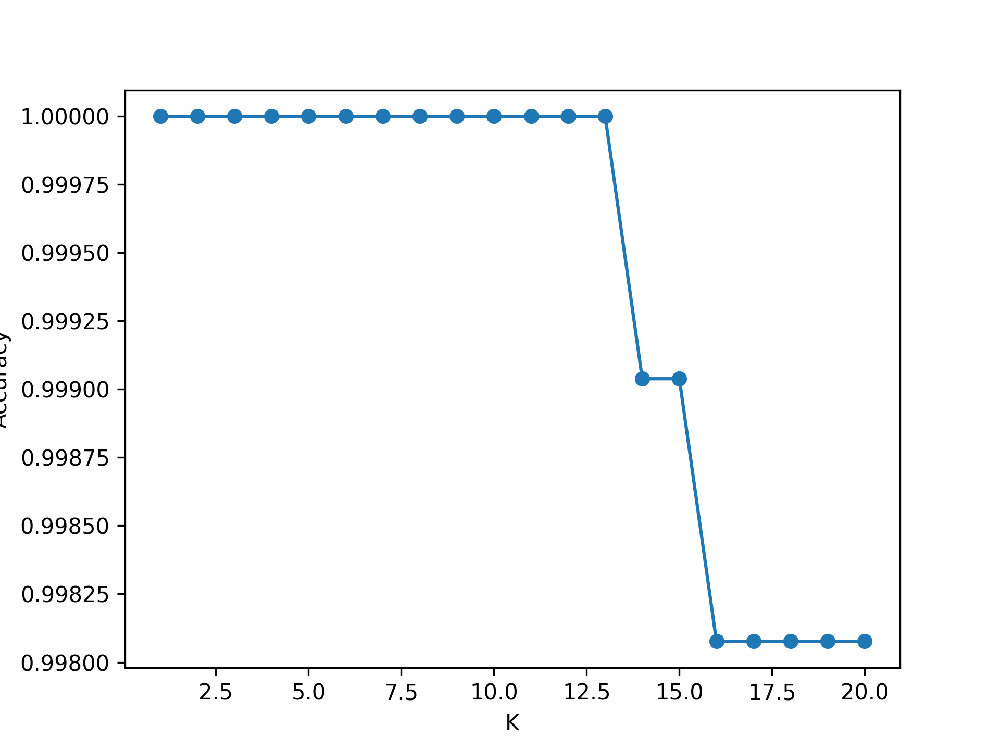
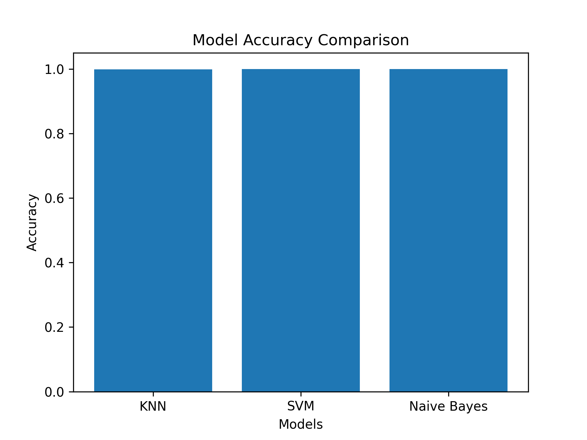

# 📩 Message Intelligence System (Spam Detection)

## 🚀 Live App  
👉 https://messageintelligencesystem-6klidfmkfjmbtxxkii7kya.streamlit.app/

---

## 📌 Project Overview  
The **Message Intelligence System** is a machine learning-based web application that classifies messages as **Spam** or **Not Spam** using numerical features extracted from text.

This project demonstrates:
- Data preprocessing  
- Feature engineering  
- Model training & evaluation  
- Deployment using Streamlit  

---

## 🎯 Objective  
To build an intelligent system that can automatically detect spam messages with high accuracy using machine learning models.

---

## ⚙️ Technologies Used  
- Python 🐍  
- NumPy & Pandas  
- Scikit-learn  
- Matplotlib & Seaborn  
- Streamlit  

---

## 🧠 Models Used  
- K-Nearest Neighbors (KNN)  
- Support Vector Machine (SVM)  
- Naive Bayes  

---

## 📊 Model Performance  

### 🔹 Confusion Matrix  


**Observation:**  
- 809 True Negatives  
- 231 True Positives  
- 0 False Positives  
- 0 False Negatives  

➡️ The model achieved **perfect classification** on the test data.

---

### 🔹 K vs Accuracy Graph  


**Observation:**  
- Best accuracy achieved for lower K values  
- Slight drop in accuracy as K increases  
- Optimal K chosen for final KNN model  

---

### 🔹 Model Accuracy Comparison  


**Observation:**  
- All models performed with very high accuracy  
- KNN, SVM, and Naive Bayes show nearly identical performance  
- KNN selected for final deployment  

---

## 🧩 Features Used  
- Message Length  
- Word Count  
- Uppercase Letter Count  
- Special Character Count  

---

## 🖥️ How to Run Locally  

```bash
git clone https://github.com/your-username/your-repo-name.git
cd your-repo-name
pip install -r requirements.txt
streamlit run app.py
```

---

## 📌 Future Improvements  
- Add real-time text input instead of numeric features  
- Improve dataset diversity  
- Use deep learning models (LSTM, BERT)  
- Enhance UI/UX  

---

## 👨‍💻 Author  
- Deep Vejpara  

---

## ⭐ Conclusion  
This project successfully demonstrates how machine learning can be applied to detect spam messages with high accuracy and deployed as an interactive web application using Streamlit.
